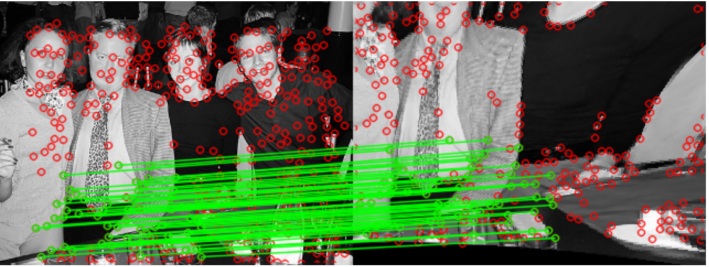
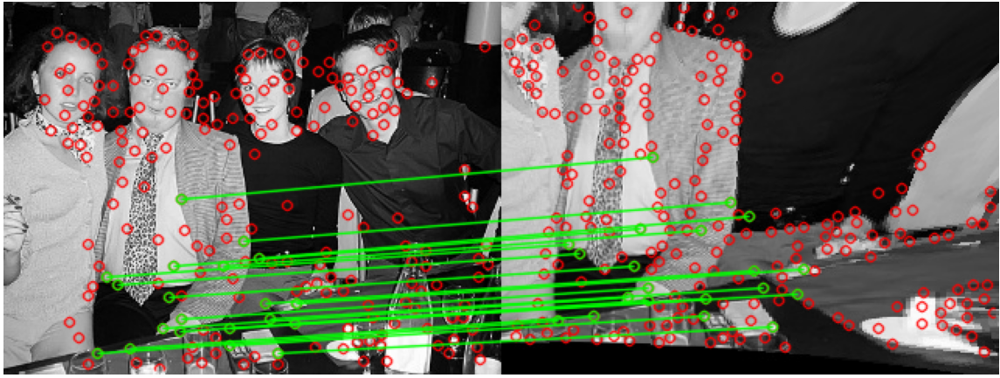

# RD-SuperPoint

This is a modified version of SuperPoint feature detector and descriptor, changed to be more robust to radial distortion. The modifications are applied over the Tensorflow implementation of SuperPoint by Rémi Pautrat and Paul-Edouard Sarlin. 

The following images show how RD-SuperPoint compares to SuperPoint and SIFT in the presence of radial distortion in the image. (From top: RD-SuperPoint, SuperPoint, SIFT).






# SuperPoint

This is a Tensorflow implementation of  "SuperPoint: Self-Supervised Interest Point Detection and Description." Daniel DeTone, Tomasz Malisiewicz, Andrew Rabinovich. [ArXiv 2018](https://arxiv.org/abs/1712.07629).


## Results on HPatches

### Detector evaluation
Repeatability on HPatches computed with 300 points detected in common between pairs of images and with a NMS of 4:
 <table style="width:100%">
  <tr>
    <th></th>
    <th>Illumination changes</th>
    <th>Viewpoint changes</th>
  </tr>
  <tr>
    <td>SuperPoint (our implementation)</td>
    <td><b>0.662</b></td>
    <td>0.674</td>
  </tr>
  <tr>
    <td>SuperPoint (<a href='https://github.com/MagicLeapResearch/SuperPointPretrainedNetwork' >pretrained model of MagicLeap<a>)</td>
    <td>0.641</td>
    <td>0.621</td>
  </tr>
  <tr>
    <td>FAST</td>
    <td>0.576</td>
    <td>0.625</td>
  </tr>
  <tr>
    <td>Harris</td>
    <td>0.630</td>
    <td><b>0.755</b></td>
  </tr>
  <tr>
    <td>Shi</td>
    <td>0.584</td>
    <td>0.629</td>
  </tr>
</table>
   
 ### Descriptors evaluation
Homography estimation on HPatches computed with a maximum of 1000 points detected in common between pairs of images, a threshold of correctness of 3 and with a NMS of 8:
 <table style="width:100%">
  <tr>
    <th></th>
    <th>Illumination changes</th>
    <th>Viewpoint changes</th>
  </tr>
  <tr>
    <td>SuperPoint (our implementation)</td>
    <td><b>0.965</b></td>
    <td>0.712</td>
  </tr>
  <tr>
    <td>SuperPoint (<a href='https://github.com/MagicLeapResearch/SuperPointPretrainedNetwork' >pretrained model of MagicLeap<a>)</td>
    <td>0.923</td>
    <td>0.742</td>
  </tr>
  <tr>
    <td>SIFT</td>
    <td>0.807</td>
    <td><b>0.766</b></td>
  </tr>
  <tr>
    <td>ORB</td>
    <td>0.523</td>
    <td>0.414</td>
  </tr>
</table>
 
Homography estimation on HPatches computed with a maximum of 1000 points detected in common between pairs of images, with all kind of changes (viewpoint and illumination) and with a NMS of 8:
 <table style="width:100%">
  <tr>
    <th>Correctness threshold</th>
    <th>e = 1</th>
    <th>e = 3</th>
    <th>e = 5</th>
  </tr>
  <tr>
    <td>SuperPoint (our implementation)</td>
    <td>0.483</td>
    <td><b>0.836</b></td>
    <td>0.910</td>
  </tr>
  <tr>
    <td>SuperPoint (<a href='https://github.com/MagicLeapResearch/SuperPointPretrainedNetwork' >pretrained model of MagicLeap<a>)</td>
    <td>0.438</td>
    <td>0.833</td>
    <td><b>0.914</b></td>
  </tr>
  <tr>
    <td>SIFT</td>
    <td><b>0.498</b></td>
    <td>0.786</td>
    <td>0.786</td>
  </tr>
  <tr>
    <td>ORB</td>
    <td>0.162</td>
    <td>0.467</td>
    <td>0.564</td>
  </tr>
</table>


## Installation

```shell
make install  # install the Python requirements and setup the paths
```
Python 3.6.1 is required. You will be asked to provide a path to an experiment directory (containing the training and prediction outputs, referred as `$EXPER_DIR`) and a dataset directory (referred as `$DATA_DIR`). Create them wherever you wish and make sure to provide their absolute paths.

[MS-COCO 2014](http://cocodataset.org/#download) and [HPatches](http://icvl.ee.ic.ac.uk/vbalnt/hpatches/hpatches-sequences-release.tar.gz) should be downloaded into `$DATA_DIR`. The Synthetic Shapes dataset will also be generated there. The folder structure should look like:
```
$DATA_DIR
|-- COCO
|   |-- train2014
|   |   |-- file1.jpg
|   |   `-- ...
|   `-- val2014
|       |-- file1.jpg
|       `-- ...
`-- HPatches
|   |-- i_ajuntament
|   `-- ...
`-- synthetic_shapes  # will be automatically created
```

## Usage
All commands should be executed within the `superpoint/` subfolder. When training a model or exporting its predictions, you will often have to change the relevant configuration file in `superpoint/configs/`. Both multi-GPU training and export are supported. Note that MagicPoint and SuperPoint only work on images with dimensions divisible by 8 and the user is responsible for resizing them to a valid dimension.

### 1) Training MagicPoint on Synthetic Shapes
```
python experiment.py train configs/magic-point_shapes.yaml magic-point_synth
```
where `magic-point_synth` is the experiment name, which may be changed to anything. The training can be interrupted at any time using `Ctrl+C` and the weights will be saved in `$EXPER_DIR/magic-point_synth/`. The Tensorboard summaries are also dumped there. When training for the first time, the Synthetic Shapes dataset will be generated.

### 2) Exporting detections on MS-COCO

```
python export_detections.py configs/magic-point_coco_export.yaml magic-point_synth --pred_only --batch_size=5 --export_name=magic-point_coco-export1
```
This will save the pseudo-ground truth interest point labels to `$EXPER_DIR/outputs/magic-point_coco-export1/`. You might enable or disable the Homographic Adaptation in the configuration file.

### 3) Training MagicPoint on MS-COCO
```
python experiment.py train configs/magic-point_coco_train.yaml magic-point_coco
```
You will need to indicate the paths to the interest point labels in `magic-point_coco_train.yaml` by setting the entry `data/labels`, for example to `outputs/magic-point_coco-export1`. You might repeat steps 2) and 3) several times.

### 4) Evaluating the repeatability on HPatches
```
python export_detections_repeatability.py configs/magic-point_repeatability.yaml magic-point_coco --export_name=magic-point_hpatches-repeatability-v
```
You will need to decide whether you want to evaluate for viewpoint or illumination by setting the entry `data/alteration` in the configuration file. The predictions of the image pairs will be saved in `$EXPER_DIR/outputs/magic-point_hpatches-repeatability-v/`. To proceed to the evaluation, head over to `notebooks/detector_repeatability_hpatches.ipynb`. You can also evaluate the repeatability of the classical detectors using the configuration file `classical-detectors_repeatability.yaml`.

### 5) Validation on MS-COCO
It is also possible to evaluate the repeatability on a validation split of COCO. You will first need to generate warped image pairs using `generate_coco_patches.py`.

### 6) Training of SuperPoint on MS-COCO
Once you have trained MagicPoint with several rounds of homographic adaptation (one or two should be enough), you can export again the detections on MS-COCO as in step 2) and use these detections to train SuperPoint by setting the entry `data/labels`:
```
python experiment.py train configs/superpoint_coco.yaml superpoint_coco
```

### 7) Evaluation of the descriptors with homography estimation on HPatches
```
python export_descriptors.py configs/superpoint_hpatches.yaml superpoint_coco --export_name=superpoint_hpatches-v
```
You will need to decide again whether you want to evaluate for viewpoint or illumination by setting the entry `data/alteration` in the configuration file. The predictions of the image pairs will be saved in `$EXPER_PATH/outputs/superpoint_hpatches-v/`. To proceed to the evaluation, head over to `notebooks/descriptors_evaluation_on_hpatches.ipynb`. You can also evaluate the repeatability of the classical detectors using the configuration file `classical-descriptors.yaml`.

## Matching Features Demo with Pretrained Weights
A set of pretrained weights is provided for you labeled `sp_v6`. You will need to extract the
weights and place the directory in your experiments directory so that the path
`$EXPER_PATH/saved_models/sp_v6` contains the weights. This can be easily done
with the following command being run from the top level, `SuperPoint`, directory.
```
tar -xzvf pretrained_models/sp_v6.tgz $EXPER_PATH/saved_models/sp_v6
```

With the pretrained weights extracted, you can run the `match_features_demo.py`
to compare SuperPoint and SIFT matches across two images:
```
python match_features_demo.py sp_v6 $DATA_PATH/HPatches/i_pool/1.ppm $DATA_PATH/i_pool/6.ppm
```
Note that you can also pass in additional arguments such as `--H`, `--W`,
`--k_best` to specify the height and width to resize the images and the maximum
number of keypoints you wish to keep from the detection process.

## Credits
This implementation was developed by [Rémi Pautrat](https://github.com/rpautrat) and [Paul-Edouard Sarlin](https://github.com/Skydes). Please contact Rémi for any enquiry.
